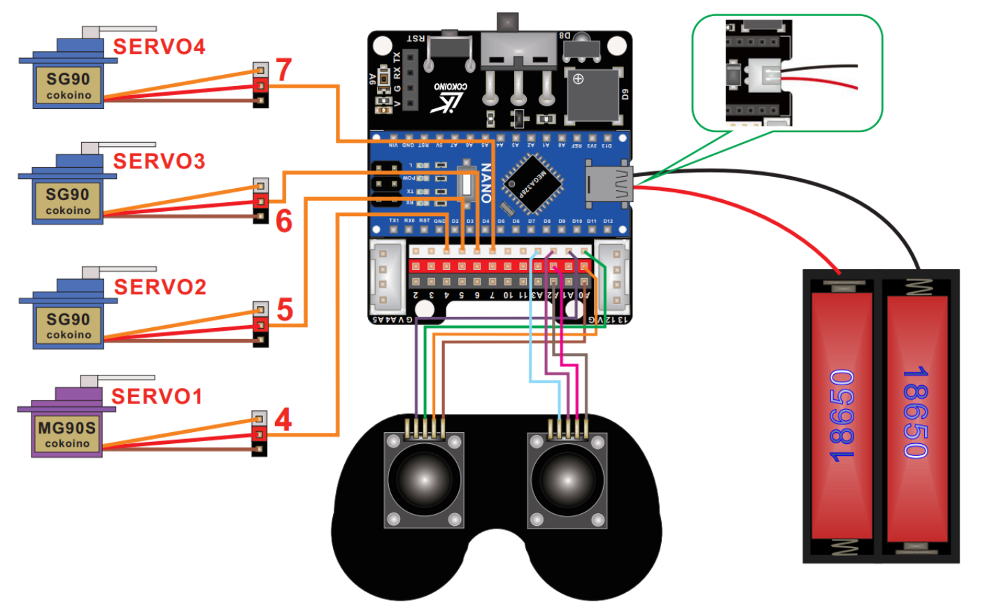
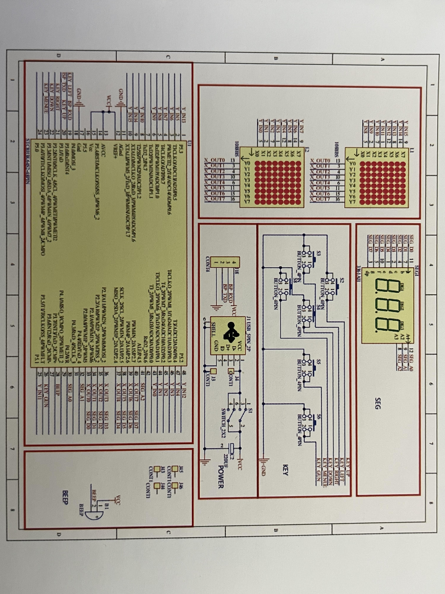

# Aidan's Three Joint Robotic Arm
<!--- Replace this text with a brief description (2-3 sentences) of your project. This description should draw the reader in and make them interested in what you've built. You can include what the biggest challenges, takeaways, and triumphs from completing the project were. As you complete your portfolio, remember your audience is less familiar than you are with all that your project entails!
My main project is the Three Joint Robotic Arm that I have modified to be attatched to a bluetooth robotic car. -->

| **Engineer** | **School** | **Area of Interest** | **Grade** |
|:--:|:--:|:--:|:--:|
| Aidan L | Leigh High School | Mechanical Engineering | Incoming Sophomore

<!--- **Replace the BlueStamp logo below with an image of yourself and your completed project. Follow the guide [here](https://tomcam.github.io/least-github-pages/adding-images-github-pages-site.html) if you need help.**

 -->

# Modifications Milestone

<!--- <iframe width="560" height="315" src="https://www.youtube.com/embed/F7M7imOVGug" title="YouTube video player" frameborder="0" allow="accelerometer; autoplay; clipboard-write; encrypted-media; gyroscope; picture-in-picture; web-share" allowfullscreen></iframe>

For your final milestone, explain the outcome of your project. Key details to include are:
- What you've accomplished since your previous milestone
- What your biggest challenges and triumphs were at BSE
- A summary of key topics you learned about
- What you hope to learn in the future after everything you've learned at BSE -->

# Final Milestone

<iframe width="560" height="315" src="https://www.youtube.com/embed/wq9YjPZBYSY?si=ElfX7R3dWFDeKhK4" title="YouTube video player" frameborder="0" allow="accelerometer; autoplay; clipboard-write; encrypted-media; gyroscope; picture-in-picture; web-share" referrerpolicy="strict-origin-when-cross-origin" allowfullscreen></iframe>

My final Milestone displays the full functions of my Three Joint Robotic Arm. The robotic arm operates through the inputs from my two joysticks on my controller. The displacement of the joysticks are measured through the potentiometers to control different servos depending on which axes they move on. The female to female wires attached to the joysticks capture the motions to feed into the Arduino Nano. Then, the Arduino uses the code from the Arduino IDE that Ben and I created to command the servos where to rotate. This information is transferred using more female to female wires from the Cokoino shield (that is connected to the Arduino) to run the servos. These functions individually control the robotic arm's three joints (including the pincers) and rotating base plate. The pincers are able to grasp onto certain light items, but the grip strength seems to be pretty weak. 

I faced the most problems on my final Milestone. The first challenge was building the robotic arm. I found that the design of the robotic arm were ridiculous and not well thought-out, making it difficult to construct. This complication led me to my next obstacle: the base of the robotic arm chipping and breaking entirely. The structures D and E (the bases of the robotic arm) are slotted into structure C (the base plate of the robotic arm) using two small stubs on each base. The small amount of hold in the groves causes the design to be susceptible to horizontal bend. While tightening some bolts after I finish building it the first time, I pushed the robotic arm too far and broke one of my bases, making it completely dysfunctional. This mishap set me back a whole day trying to fix my mistake. I decided to add hot glue to the bases to support them further to prevent any future damage. My last barrier was that the given code not working with my robotic arm. When I thought all my hardships were over, the code was not functioning with my robotic arm. After some consideration, Ben had adviced me to recode everything beacause their code was not great and not working, so we decided to do it alongside his help. Ben had taught me many things when it comes to coding C++/on Arduino IDE and many other functions of different components, and I would like to thank him because I wouln't have been able to do it alone. When we finished it, the robotic arm worked flawlessly. 

My last steps to complete my final project is to add my modification to attach the Three Joint Robotic Arm onto a robotic car to make it mobile. I will control the robotic car by using a bluetooth transceiver to connect to a Android phone, controlling it using an app that I would make on the MIT App Inventor.  

# Second Milestone

<iframe width="560" height="315" src="https://www.youtube.com/embed/62v-hwCqD9Y?si=V5SEFIW0lsW38_ax" title="YouTube video player" frameborder="0" allow="accelerometer; autoplay; clipboard-write; encrypted-media; gyroscope; picture-in-picture; web-share" referrerpolicy="strict-origin-when-cross-origin" allowfullscreen></iframe>


My second Milestone shows the compatibility of the servo to my Arduino Nano. The micro servo has many gears and a small circuit board that can control how much the gears turn through inputs. These inputs can be read through my Arudino IDE on my computer that outputs the information to my Arduino. The data then flows through the three female to female wires into the servo's circuit board. The numbers inputted are numerical and each represent an angle. For example, if I input the number 3, the servo will rotate 60 degrees. These servos will be used to move the base, joints, and pincers of the robotic arm. So far, the instructions have been fairly easy to follow, only consisting of testing the robotic components. 

The problem I had faced during my second Milestone was trying to get the servos working. My instructor Ben and I tried many things to make it function, even gathering data using the oscilloscope to see if the Arduino was actually making an output. We then decided to search up the servo online and realized it needed 4.8 volts to activate. We figured that my computer was outputting some amount of voltage into my Arduino because it was working when testing my joystick, but not enough energy to power the servos. We fixed this problem by easily attatching batteries into the Arduino. 

To reach my final Milestone, I would need to build my robotic arm and finally test it.

# First Milestone

<iframe width="560" height="315" src="https://www.youtube.com/embed/zen-y9g0eFM?si=V7BoQDgwfVFaTILo" title="YouTube video player" frameborder="0" allow="accelerometer; autoplay; clipboard-write; encrypted-media; gyroscope; picture-in-picture; web-share" referrerpolicy="strict-origin-when-cross-origin" allowfullscreen></iframe>

My first Milestone demonstrates the functions of the joystick to my Arduino IDE. The displacement of the joystick is measured using a potentiometer. Potentiometers create a graph that contain x and y axes to display the location numarically of the joystick. These inputs are first fed through three female to female wires into the Arduino Nano to finally transfer into the Arduino IDE on my computer. The output is shown using a serial motor that constantly sends lines of x, y, and z points depending on the joystick position. But the z axis will stay as 0 beacause the potentiometer does not calculate the displacment in height even when the joystick is pressed down. I have currently not built anything of the physical robot, but have only tested my systems and code.

The only minor problems I had faced during my first Milestone was trying to place the female to female wires onto the Arduino pins. The pins are tightly grouped and leave very little space for each wire to slot in. The heads of the wire were also very loose, making it very easy to unplug if tugged slightly. The only solution to my challenges are to be careful with the wires and to have patience when connecting them to my Arduino.

My plan for my second Milestone is to follow each and every step of my main project guide properly and precisely. 

# Schematics 



# Final Project Code 

To Control the Three Joint Robotic Arm

```c++
#include <Servo.h>
#include <Joystick.h>

Servo Servo_1;
Servo Servo_2;
Servo Servo_3;
Servo Servo_4;

struct ServoTarget {
  int ServoLocation;
  int ServoDestination;
};

ServoTarget ServoTarget_1;
ServoTarget ServoTarget_2;
ServoTarget ServoTarget_3;
ServoTarget ServoTarget_4;

void setup() {
  // put your setup code here, to run once:

  Servo_1.attach(4);
  Servo_2.attach(5);
  Servo_3.attach(6);
  Servo_4.attach(7);

  ServoTarget_1.ServoDestination = 110;
  ServoTarget_2.ServoDestination = 90;
  ServoTarget_3.ServoDestination = 90;
  ServoTarget_4.ServoDestination = 90;
}

void UpdateServo(ServoTarget & Motion) {
  // holds positioning of servo through increments of disposition

  int diff = (Motion.ServoDestination - Motion.ServoLocation) / 2;
  Motion.ServoLocation += diff;

  if (0 > Motion.ServoDestination) {
    Motion.ServoDestination = 0;
  }

  if (180 < Motion.ServoDestination) {
    Motion.ServoDestination = 180;
  }

}

void loop() {
  // put your main code here, to run repeatedly:

  int LX = analogRead(A0)/100 - 5;
  int LY = analogRead(A1)/100 - 5;

  int RX = analogRead(A2)/100 - 5;
  int RY = analogRead(A3)/100 - 5;

  ServoTarget_1.ServoDestination += LY;
  ServoTarget_2.ServoDestination += LX;
  ServoTarget_3.ServoDestination += RX;
  ServoTarget_4.ServoDestination += RY;
  delay(25);

  UpdateServo(ServoTarget_1);
  UpdateServo(ServoTarget_2);
  UpdateServo(ServoTarget_3);
  UpdateServo(ServoTarget_4);

  Servo_1.write(ServoTarget_1.ServoLocation);
  Servo_2.write(ServoTarget_2.ServoLocation);
  Servo_3.write(ServoTarget_3.ServoLocation);
  Servo_4.write(ServoTarget_4.ServoLocation);
  
}
``` 

# Bill of Materials

| Cokoino Robotic Arm | Cokonio's building kit of Three Joint Robotic Arm | $49.99 | <a href="https://www.amazon.com/LK-COKOINO-Compliment-Engineering-Technology/dp/B081FG1JQ1"> Link </a> |
| YIKESHU 2WD Smart Robot Car Chassis Kit | Mobility for the Three Joint Robotic Arm | $18.99 | <a href="https://www.amazon.com/YIKESHU-Smart-Chassis-Encoder-Battery/dp/B073VHQT6P/ref=sr_1_2?crid=PJ0L8E9W0VVU&dib=eyJ2IjoiMSJ9.rAtzeTMewjqQtbfHoPTpllczQ2na8OWPtlJRUuewEoY.Hsresp6GxwOBatjmspXvGbFKHDawa3rjwxLRsZ6dDOA&dib_tag=se&keywords=yikeshu+2wk+smart+robotic+car&qid=1718731589&s=toys-and-games&sprefix=yikeshu+2wk+smart+robotic+c%2Ctoys-and-games%2C154&sr=1-2"> Link </a> |
| HiLetgo HC-05 Wireless Bluetooth RF Transceiver | Bluetooth transmitter to Android phone to control remotely (Cannot connect to Apple phones and any Android phone will work) | $10.39 | <a href="https://www.amazon.com/HiLetgo-Wireless-Bluetooth-Transceiver-Arduino/dp/B071YJG8DR/ref=sr_1_1_sspa?dib=eyJ2IjoiMSJ9.Fvznp6fvF7wjC0kJ6xPyvRFh9TrLHlqb70zpeseXKYiXsVnnSomI7bFg3POK4yN5SYAJbh-wFY3h16kh4eqELdjpuRyqqfIkQK_QkpsgcrOVEAfG5gRtwVGzgtR5oBGO8RzX58HVx2ns_4dmCE-fXykk63D9uD5v_aNtR_6ZIAOefCoDhrxnSgE_rIJRJ_FE4cGnqRvdy6PsszvnY4HthKAKd9va-ilVFBpZlgxN7ic.Kdoj-AtF2A7jSgcsJKx0KAAZX8bjhtRzosEvWA6jaz8&dib_tag=se&keywords=hiletgo+hc-05+wireless&qid=1718731878&sr=8-1-spons&sp_csd=d2lkZ2V0TmFtZT1zcF9hdGY&psc=1"> Link </a> |
| TracFone Motorola moto g Pure (Android phone) | To control the smart robotic car remotely through my own app made using MIT App Inventor | $49.99 | <a href="https://www.amazon.com/TracFone-Motorola-Moto-Pure-32GB/dp/B0CHH1N9VY/ref=sr_1_1?crid=3H0EMGZ2XDU2H&dib=eyJ2IjoiMSJ9.clKUP8zpT3LgQhvuvfuiUvDqeq-907Wut8620NpI0vIpmGWVC-ShBg6Z3vGFFmKSSXgJqWVFEBOUpcsH2XfKSoL3Aj6TvdeNcWaSFTlLeuJI8rtQJLR0e2gDUEH6f4PiuiOcaENwP_9cNnAGT7C-GYn5eZEaonbYX1jpGCCY_DNHSrg78Hr8KrIEL111davpLqXDtttn3fvUswIsIoggs8b9ckSoS9IJGVHQ2lOeDpQ.5fqgRgw2toVuZa9z4ovXgbev262t99HW8GxvT7pUPX4&dib_tag=se&keywords=tracfone%2Bmotorola%2Bmoto%2Bg%2Bpure&qid=1718812513&sprefix=tracfone%2Bmotorola%2Bmoto%2Bg%2Bpure%2B%2Caps%2C153&sr=8-1&th=1"> Link </a> |
<!--- | Item Name | What the item is used for | $Price | <a href="https://www.amazon.com/Arduino-A000066-ARDUINO-UNO-R3/dp/B008GRTSV6/"> Link </a> |
| Item Name | What the item is used for | $Price | <a href="https://www.amazon.com/Arduino-A000066-ARDUINO-UNO-R3/dp/B008GRTSV6/"> Link </a> |

# Other Resources/Examples
One of the best parts about Github is that you can view how other people set up their own work. Here are some past BSE portfolios that are awesome examples. You can view how they set up their portfolio, and you can view their index.md files to understand how they implemented different portfolio components.
- [Example 1](https://trashytuber.github.io/YimingJiaBlueStamp/)
- [Example 2](https://sviatil0.github.io/Sviatoslav_BSE/)
- [Example 3](https://arneshkumar.github.io/arneshbluestamp/) -->
- 

# Starter Project: Retro Arcade Console 

<iframe width="560" height="315" src="https://www.youtube.com/embed/UlN1hSnhQcY?si=dF2FZOEe-0TgTIOz" title="YouTube video player" frameborder="0" allow="accelerometer; autoplay; clipboard-write; encrypted-media; gyroscope; picture-in-picture; web-share" referrerpolicy="strict-origin-when-cross-origin" allowfullscreen></iframe>

This is the Retro Arcade Console Starter Project. The console uses the pre-soldered CPU on the board to read the input of the seven buttons to determine its next action based of its pre-coded information. It sends binary code, series of 1's and 0's, to the LED's to tell each LED to either turn on or off. There are two options to power the arade: USB and batteries. The Arcade is powered by three AAA batteries, connected through a red and black wire to the USB port to describute energy to all components. 

I fought against two main problems: making the buzzer work and going back to fix my work. The instructors and I could not fix it because we did not understand why it is shorting. The two solders were very far apart yet the multimeter was still reading a short. We tried using a wick to pick up any metal particles inbetween the two solders and Another problem I faced was having the fix my mistakes along the way. I strugged on having to go back on my work to make all of the components work properly. I had many errors such as the solder not fully touching the board and some shorts on the LED panel that caused two columns of LED's to not function. 

The lesson I learned with my starter project is to be cautious and accurate with my work. This will help me progess through my final project smoothly without any difficulties. After finishing my starter project, I will be working on my main project which is the Three Joint Robotic Arm. 

# Schematics 



# Starter Project Code 

To Create the 5 Retro Classic Games

```c++
ALL CODE WAS PRE-PROGRAMMED INTO THE CPU
``` 

# Bill of Materials

| DIY Solder Retro Arcade Console | VOGURTIME's DIY Solder building kit of Retro Arcade Console | $18.49 | <a href="https://www.amazon.com/Electronic-Soldering-Practice-Comfortable-VOGURTIME/dp/B094QRRHC2/ref=sr_1_3?crid=12C0SOV36FG6M&dib=eyJ2IjoiMSJ9.Prj06eg0mzBHrfW8zuFr43Ott4t2wUOVBo8A8bYw0PqFZRlOEmgR5YwhMy7jXrdI2HlBjVttnEyYLz5CP684SzJyHmVMBp25vNna9o8wjV-df55ilTgj0xMy1CiRwkcnu6xqacZ3JUPlq8C3mQJwmEtoeokndNqpwpdkZBQMplM9vg3M-cfB0xM_nXdjeqHQ3bB707ehrzX6Llp-Euu3CTFzF8wgEqhPwo6RCvzbo5M.yyrFg8EXJr9BL5cOgZF551-8cIl91p0MSy8nGiilcpU&dib_tag=se&keywords=arcade%2Bsolder%2Bproject&qid=1717994267&sprefix=arcade%2Bsolder%2Bprojec%2Caps%2C147&sr=8-3&th=1"> Link </a> |

<!--- # Other Resources/Examples
One of the best parts about Github is that you can view how other people set up their own work. Here are some past BSE portfolios that are awesome examples. You can view how they set up their portfolio, and you can view their index.md files to understand how they implemented different portfolio components.
- [Example 1](https://trashytuber.github.io/YimingJiaBlueStamp/)
- [Example 2](https://sviatil0.github.io/Sviatoslav_BSE/)
- [Example 3](https://arneshkumar.github.io/arneshbluestamp/)
-
